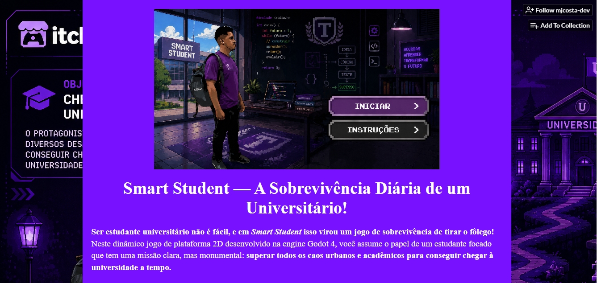
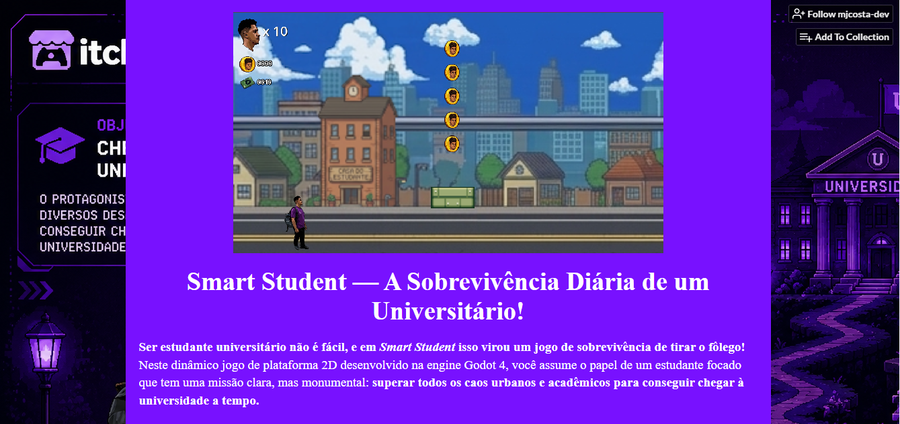
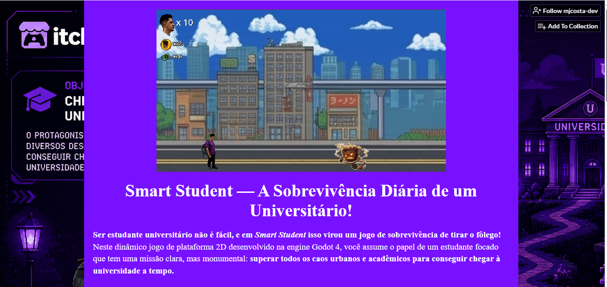

# Smart Student — A Sobrevivência Diária de um Universitário!

Jogo 2D de plataforma desenvolvido na engine **Godot 4**.

Ser estudante universitário não é fácil, e em *Smart Student* isso virou um jogo de sobrevivência de tirar o fôlego! Você assume o papel de um estudante focado que tem uma missão clara, mas monumental: **superar todos os caos urbanos e acadêmicos para conseguir chegar à universidade a tempo.**

## Jogar

https://mjcosta-dev.itch.io/smart-student

## Screenshots

